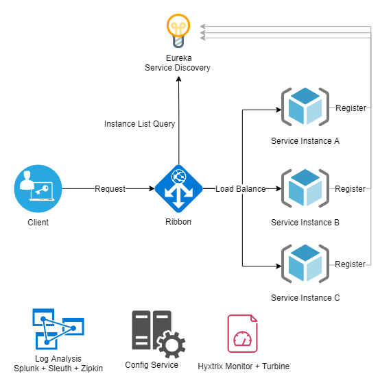

#  Application - POC Spring Boot

Este projeto apresenta diretrizes e receitas baseados em Spring Boot e suas tecnologias, desenvolvidos para fins educacionais.

Modelo da arquitetura elaborada para esse case:

Você pode executar a compilação completa executando o seguinte comando no prompt:

    gradle clean build

Você pode executar o aplicativo da Web Spring Boot pelo seguinte comando no prompt:

    gradle bootRun
    
Quando o aplicativo está em execução, você pode acessá-lo acessando com a url:

    http://localhost:8080/swagger-ui.html
